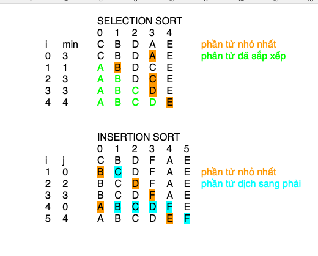

## Câu 2
2.1 Giải thích thế nào là External Sort?
    External Sort là thuật ngữ chỉ thuật toán sắp xếp cho dữ liệu có kích thước lớn, khi mà nó lớn hơn bộ nhớ trong (RAM) của máy tính. Lúc này kích thước của dữ liệu được chia nhỏ ra sao cho vừa với kích thước bộ nhớ RAM. Thực hiện sắp xếp các đoạn dữ liệu, lưu tạm thời ra bộ nhớ ngoài. Tiếp theo thực hiện hợp nhất (merge-sort) các tệp dữ liệu đã sắp xếp thành dữ liệu hoàn chỉnh đã sắp xếp.
2.2 Merge-sort có stable không? Quick-sort có stable không?
    Merge-sort là stable
    Quick-sort không stable
2.3 Vì sao thực tế lại kết hợp Merge-sort với Insertion-sort?
    Implement thuật toán merge-sort là dưới dạng đệ quy, khi quá trình đệ quy đến kích thức dữ liệu đủ nhỏ ta thực hiện sắp xếp chúng bằng insertion-sort.
    Việc đệ quy đảm bảo các đoạn dữ liệu nhỏ sẽ được thực hiện bởi insertion-sort một cách toàn bộ, hơn nữa nó nhanh hơn so với các thuật toán khác cho dữ liệu kích thước nhỏ.
    Việc cải thiện này dẫn đến toàn bộ thuật toán được tối ưu.
## Câu 1
1.1 Nếu chi phí swap dữ liệu tốn kém hơn nhiều so với so sánh dữ liệu thì dùng kiểu sort nào? Bubble sort, Insertion sort hay Selection sort
        Chọn Selection Sort
    Selection Sort có N     swap
    Insertion Sort có N^2/4 swap
1.2 Nếu chi phí so sánh dữ liệu tốn kém hơn nhiều so với swap dữ liệu thì dùng kiểu sort nào? Bubble sort, Insertion sort hay Selection sort
        Chọn Insertion Sort
    Selection Sort có N^2/2 compare
    Insertion Sort có N^2/4 compare
1.3 vẽ trạng thái của mảng.
    